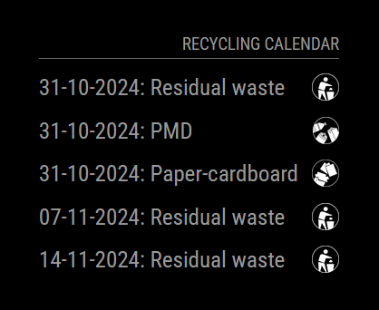

# MMM-FostPlus-RecyclingCalendar

This module displays a recycling calendar for a specific Belgian region 

This module is an extension of the [MagicMirror² project](https://github.com/MichMich/MagicMirror).

## Screenshot


## Installation
1. Navigate into your MagicMirror's modules folder
2. Execute: `git clone https://github.com/MaartenGVS/MMM-FostPlus-RecyclingCalendar`
3. Navigate to the MMM-FostPlus-RecyclingCalendar directory: cd MMM-FostPlus-RecyclingCalendar`
4. Add [config](https://github.com/MaartenGVS/MMM-FostPlus-RecyclingCalendar#configuration)
5. Done


## Configuration
Sample configuration entry for your `~/MagicMirror/config/config.js`:

```
{
  module: "MMM-Howest-Resto",
  position: "bottom_left",
  config: {
    resto: "RSS1"
  }
},
```


## Configuration options

The following properties can be configured:

| Key   | Description                                 | Default |                      Example                      |
|-------|---------------------------------------------|:-------:|:-------------------------------------------------:|
| resto | The abbreviation of a specific Howest resto |  RSS1   | 'GKG', 'PENTA', 'RSS', 'RSS1', 'SIC', 'SJS', 'TS' |

## Dependencies
This module is using the [Fost Plus API](https://api.fostplus.be/recyclecms/public/v1).

## Report bugs
You can report bugs here: [https://github.com/MaartenGVS/MMM-Howest-Resto/issues](https://github.com/MaartenGVS/MMM-Howest-Resto/issues)
